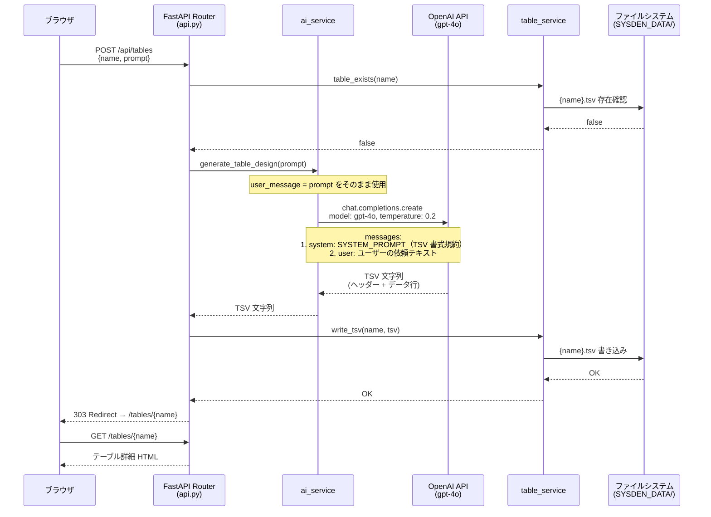
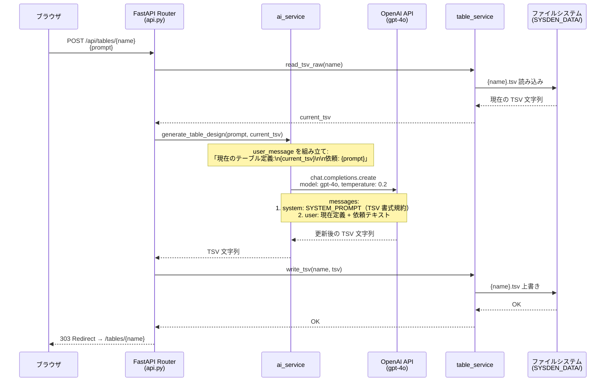

# テーブル設計 TSV 生成フロー

ユーザーがブラウザからテーブル設計を依頼し、LLM が TSV 形式のカラム定義を生成するまでのシーケンス。

## 概要

sysden のテーブル設計機能は、ユーザーの自然言語プロンプトを OpenAI Chat Completions API に送信し、構造化された TSV（タブ区切り）形式のカラム定義を受け取る。新規作成と既存テーブルの更新で、LLM に送るメッセージの組み立て方が異なる。

## シーケンス図

### 新規テーブル作成

### 既存テーブル更新

## 各コンポーネントの役割

| コンポーネント | ファイル | 責務 |
|---|---|---|
| **API Router** | `app/routers/api.py` | HTTP リクエスト受付、バリデーション、サービス呼び出し、リダイレクト |
| **ai_service** | `app/ai_service.py` | LLM クライアント管理、プロンプト組み立て、API 呼び出し |
| **table_service** | `app/table_service.py` | TSV ファイルの CRUD、Markdown 変換 |
| **HTML Router** | `app/routers/html.py` | テーブル詳細画面の描画（TSV → Markdown → HTML） |

## LLM 通信の詳細

### システムプロンプト

LLM には「データベーステーブル設計アシスタント」としてのロールと、TSV の出力書式ルールをシステムプロンプトで指定する。プロンプト定義は `prompts/ai_prompts.yaml` で管理されている。

### メッセージ構成

| # | role | 内容 |
|---|---|---|
| 1 | `system` | TSV 書式規約（ヘッダー形式、YES/NO 表記、日本語 description） |
| 2 | `user` | **新規**: ユーザーの依頼テキストそのまま |
|   |        | **更新**: `現在のテーブル定義:\n{TSV}\n\n依頼: {テキスト}` |

### API パラメータ

| パラメータ | 値 | 理由 |
|---|---|---|
| `model` | `gpt-4o` | 構造化出力の精度を優先 |
| `temperature` | `0.2` | TSV 形式の安定性を確保するため低めに設定 |

### テストモード

環境変数 `SYSDEN_TEST_MODE=1` が設定されている場合、LLM API を呼ばずスタブ TSV を返す。E2E テストで使用する。
