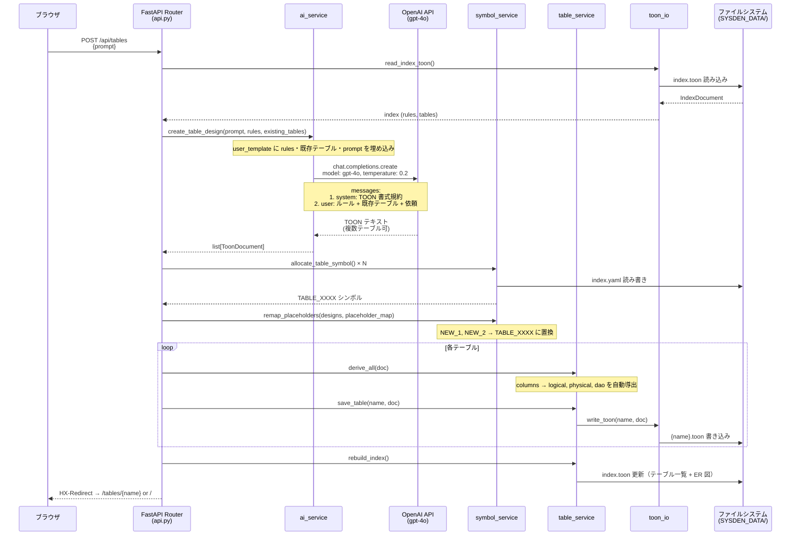
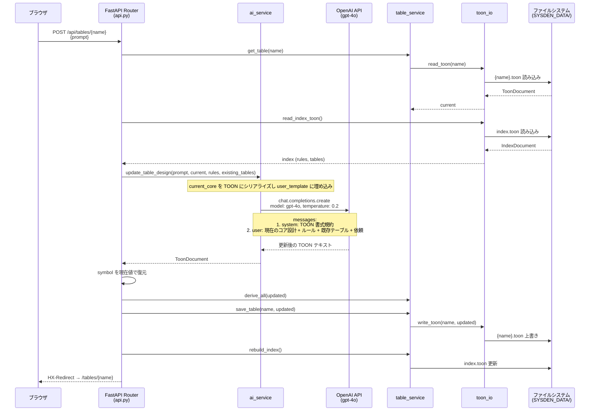

# テーブル設計 TOON 生成フロー

ユーザーがブラウザからテーブル設計を依頼し、LLM が TOON 形式のコア設計を生成するまでのシーケンス。

## 概要

sysden のテーブル設計機能は、ユーザーの自然言語プロンプトを OpenAI Chat Completions API に送信し、構造化された TOON 形式のコア設計（meta + columns）を受け取る。AI はコア設計のみを生成し、logical（論理設計）・physical（物理設計）・dao（ドメインオブジェクト属性）は `table_service.derive_all()` がコア設計から自動導出する。新規作成と既存テーブルの更新で、LLM に送るメッセージの組み立て方が異なる。

## シーケンス図

### 新規テーブル作成



### 既存テーブル更新



## 各コンポーネントの役割

| コンポーネント | ファイル | 責務 |
|---|---|---|
| **API Router** | `app/routers/api.py` | HTTP リクエスト受付、バリデーション、サービス呼び出し、リダイレクト |
| **ai_service** | `app/ai_service.py` | プロンプト組み立て（YAML テンプレート）、LLM 呼び出し、TOON パース |
| **symbol_service** | `app/symbol_service.py` | テーブル・カラムのシンボル採番、FK プレースホルダ置換 |
| **table_service** | `app/table_service.py` | テーブル CRUD、logical/physical/dao 導出、インデックス・ER 図再構築 |
| **toon_io** | `app/toon_io.py` | TOON フォーマットの読み書き・パース・シリアライズ |
| **models** | `app/models.py` | Pydantic データモデル（`ToonDocument`, `Column`, `TableMeta`, `IndexDocument`, `TableSummary`） |
| **HTML Router** | `app/routers/html.py` | テーブル詳細画面の描画（logical/physical/dao → Markdown テーブル → HTML） |

## LLM 通信の詳細

### システムプロンプト

LLM には「データベーステーブル設計アシスタント」としてのロールと、TOON の出力書式ルールをシステムプロンプトで指定する。プロンプト定義は `prompts/ai_prompts.yaml` で管理されている。新規作成（`core_create`）と更新（`core_update`）で別のテンプレートを使用する。

### メッセージ構成

| # | role | 内容 |
|---|---|---|
| 1 | `system` | TOON 書式規約（meta + columns フォーマット、symbol 命名規則、型表記） |
| 2 | `user` | **新規**: 共通ルール + 既存テーブル一覧 + ユーザーの依頼テキスト |
|   |        | **更新**: 現在のコア設計（TOON） + 共通ルール + 既存テーブル一覧 + 依頼テキスト |

### API パラメータ

| パラメータ | 値 | 理由 |
|---|---|---|
| `model` | `gpt-4o` | 構造化出力の精度を優先 |
| `temperature` | `0.2` | TOON 形式の安定性を確保するため低めに設定 |

### テストモード

環境変数 `SYSDEN_TEST_MODE=1` が設定されている場合、LLM API を呼ばずスタブ TOON を返す。E2E テストで使用する。

## TOON フォーマット

[TOON](https://github.com/toon-format/toon) は LLM 向けに提案されているデータフォーマット。AI が生成するコア設計の形式:

```
meta:
  logical_name: 日本語テーブル名
  physical_name: 英語スネークケース
  description: テーブルの説明

columns[N]{symbol,logical_name,physical_name,type,nullable,pk,unique,default,fk_target,description}:
  COLUMN_0001,日本語カラム名,英語カラム名,SQL型,YES/NO,YES/NO,YES/NO,デフォルト値,FK参照先シンボル,説明
```

`table_service.derive_all()` がコア設計から以下のセクションを自動導出して追加する:

- **logical**: 論理設計（日本語型名、必須マーク、ユニーク表記）
- **physical**: 物理設計（id, created_at, updated_at, disabled_at を自動付与）
- **dao**: ドメインオブジェクト属性（Python 型、バリデーション制約）
