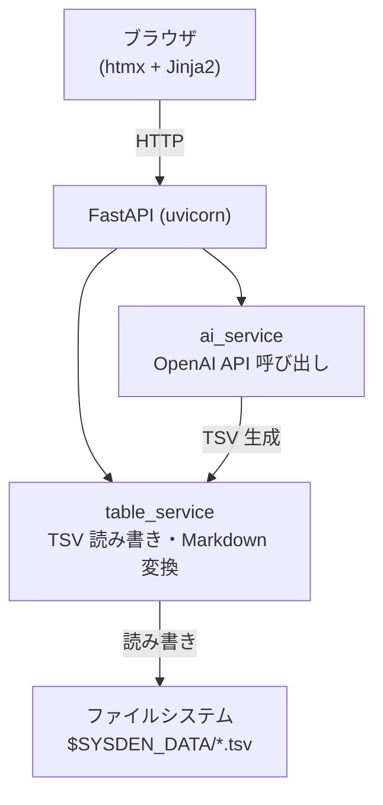

# sysden — テーブル設計 Web アプリ 設計ドキュメント

**日付**: 2026-06-19
**ステータス**: ドラフト

## 概要

- テーブル設計（カラム定義）を TSV ファイルで管理・閲覧する Web アプリ
- **人向けのテキストエディタは提供しない**。設計の作成・更新はブラウザ上の依頼 UI から AI（OpenAI）に依頼して行う
- ストレージは **ファイルシステム**（TSV ファイル）
- フロントエンドは **htmx + Jinja2 + markdown-it-py**

---

## 要件サマリ

| 項目 | 内容 |
|---|---|
| コア体験 | 依頼文を送る → AI が TSV 形式のテーブル設計を生成・更新 → Markdown テーブルとしてブラウザ表示 |
| 永続化 | ファイルシステム。環境変数 `SYSDEN_DATA` で指定したディレクトリ（省略時: `.data`） |
| ファイル形式 | `<SYSDEN_DATA>/<table_name>.tsv`（タブ区切り） |
| AI 連携 | FastAPI バックエンドが OpenAI API を呼び出し TSV を生成 |
| 認証 | `OPENAI_API_KEY` を `.env` から取得 |

---

## TSV フォーマット

ヘッダー行 + データ行のタブ区切りテキスト。カラム定義:

| フィールド | 説明 |
|---|---|
| `column_name` | カラム名 |
| `type` | データ型（例: UUID, VARCHAR(255), INTEGER） |
| `nullable` | NULL 許容: `YES` / `NO` |
| `pk` | 主キー: `YES` / `NO` |
| `unique` | ユニーク制約: `YES` / `NO` |
| `default` | デフォルト値（なければ空） |
| `description` | 説明 |

例（`users.tsv`）:

```
column_name	type	nullable	pk	unique	default	description
id	UUID	NO	YES	YES		主キー
email	VARCHAR(255)	NO	NO	YES		メールアドレス
name	VARCHAR(100)	NO	NO	NO		ユーザー名
created_at	TIMESTAMPTZ	NO	NO	NO	now()	作成日時
```

---

## アーキテクチャ



- AI 呼び出しは同期実行（SSE・非同期キュー不要）
- DB・マイグレーション不要

---

## ルート設計

| ルート | メソッド | 役割 | 返却 |
|---|---|---|---|
| `/` | GET | テーブル一覧 | HTML |
| `/tables/{name}` | GET | テーブル設計ビューア | HTML |
| `/api/tables` | POST | 新規テーブル設計を AI に依頼 | redirect |
| `/api/tables/{name}` | POST | 既存テーブル設計を AI に更新依頼 | redirect |
| `/api/tables/{name}` | DELETE | テーブル設計を削除 | JSON |

---

## 技術スタック

| パッケージ | 用途 |
|---|---|
| fastapi / uvicorn[standard] | Web サーバー |
| openai | OpenAI API クライアント |
| markdown-it-py | Markdown → HTML 変換 |
| jinja2 | HTML テンプレート |
| python-multipart | フォームデータ受信 |
| python-dotenv | `.env` ファイル読み込み |
| htmx | 宣言的 DOM 更新 |

**開発ツール**: uv / taskipy / ruff / ty / pytest

---

## テスト方針

- **unit**: `table_service`（TSV 読み書き・Markdown 変換）、`ai_service`（OpenAI モック）
- **integration**: FastAPI `TestClient` でルート確認
- カバレッジ 80% 以上

---

## スコープ外

- RDBMS・マイグレーション
- ユーザー認証
- SSE / 非同期ジョブキュー
- テーブル設計以外のドキュメント種別
- Docker（シンプルなファイルアプリのため不要）
