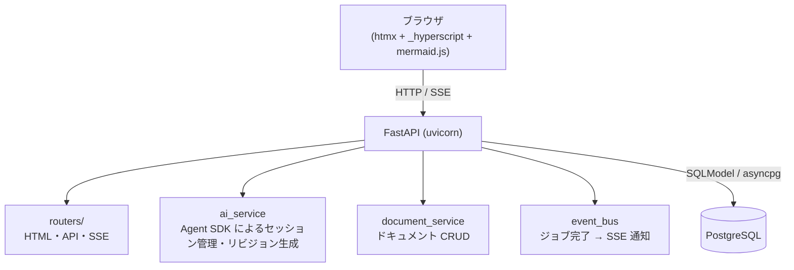
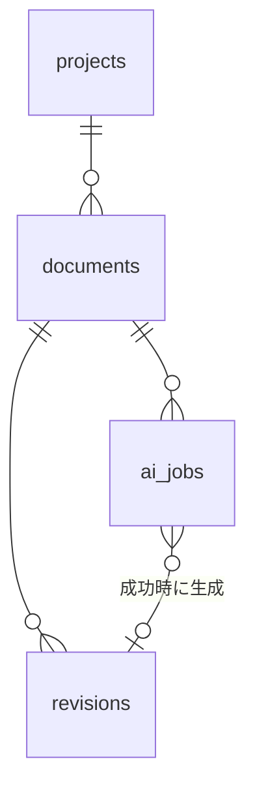
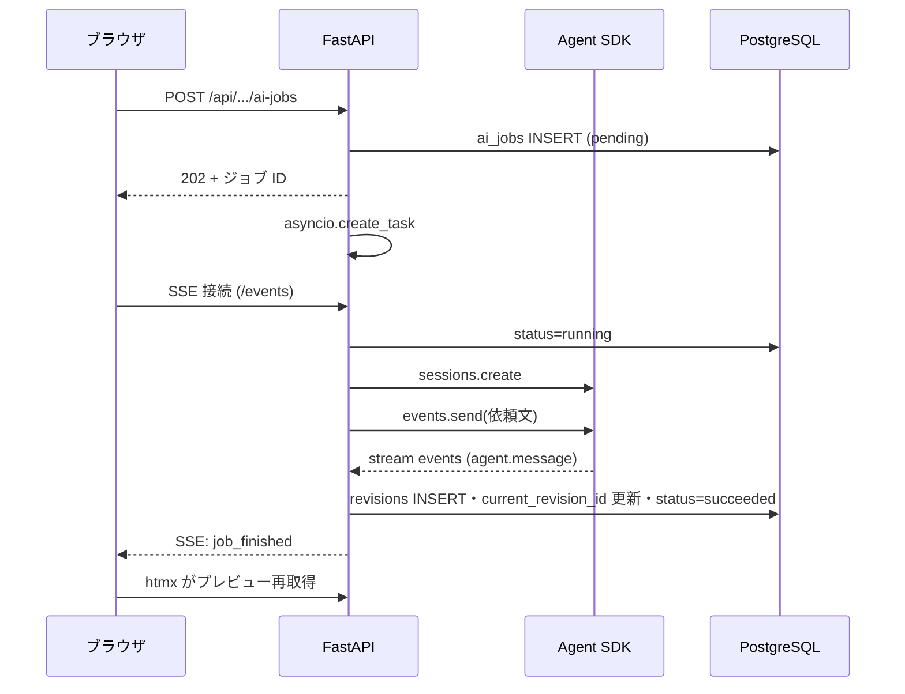

# システム設計 Web アプリ — 設計ドキュメント

**日付**: 2026-06-18
**ステータス**: ドラフト

## 概要

- markdown + mermaid で書かれたシステム設計ドキュメントを管理・閲覧する Web アプリ
- **人向けのテキストエディタは提供しない**。ドキュメントの作成・更新は
  ブラウザ上の依頼 UI から AI（Claude API）に依頼して行う
- ストレージは **PostgreSQL**
- フロントエンドは **htmx + _hyperscript + Jinja2 + mermaid.js**

---

## 要件サマリ

| 項目 | 内容 |
|---|---|
| コア体験 | 依頼文を送る → AI が markdown + mermaid の設計書を生成・更新 → ブラウザでプレビュー |
| 編集手段 | AI 依頼のみ（人向けエディタなし）。誤生成はリビジョン履歴からのロールバックで救済 |
| 永続化 | PostgreSQL（ドキュメント本文・リビジョン履歴・AI ジョブ） |
| 利用形態 | 実装はシングルユーザー（認証なし）。スキーマはマルチユーザー拡張前提で設計 |
| AI 連携 | バックエンド（FastAPI）が Anthropic Agent SDK を使って Claude を呼ぶ |

---

## アーキテクチャ



- AI 生成は数十秒かかるため**非同期ジョブ**として扱い、完了を SSE でブラウザに通知する
- htmx が宣言的な DOM 更新を担い、_hyperscript がズーム・キーボードショートカット等の
  インタラクティブな振る舞いを担う

---

## データモデル

<!-- constrained-by #要件サマリ -->



```sql
CREATE TABLE projects (
    id          UUID PRIMARY KEY DEFAULT gen_random_uuid(),
    name        TEXT NOT NULL,
    description TEXT NOT NULL DEFAULT '',
    created_by  UUID,                          -- マルチユーザー拡張ポイント（当面 NULL）
    created_at  TIMESTAMPTZ NOT NULL DEFAULT now(),
    updated_at  TIMESTAMPTZ NOT NULL DEFAULT now()
);

CREATE TABLE documents (
    id                  UUID PRIMARY KEY DEFAULT gen_random_uuid(),
    project_id          UUID NOT NULL REFERENCES projects(id) ON DELETE CASCADE,
    title               TEXT NOT NULL,
    current_revision_id UUID,                  -- 表示対象リビジョン（ロールバックで付け替え）
    created_by          UUID,
    created_at          TIMESTAMPTZ NOT NULL DEFAULT now(),
    updated_at          TIMESTAMPTZ NOT NULL DEFAULT now()
);

CREATE TABLE revisions (
    id          UUID PRIMARY KEY DEFAULT gen_random_uuid(),
    document_id UUID NOT NULL REFERENCES documents(id) ON DELETE CASCADE,
    rev_no      INTEGER NOT NULL,              -- ドキュメント内連番（1 始まり）
    content     TEXT NOT NULL,                 -- markdown 全文（mermaid フェンス含む）
    ai_job_id   UUID,                          -- 生成元ジョブ（手動ロールバック時は NULL）
    created_by  UUID,
    created_at  TIMESTAMPTZ NOT NULL DEFAULT now(),
    UNIQUE (document_id, rev_no)
);

CREATE TABLE ai_jobs (
    id          UUID PRIMARY KEY DEFAULT gen_random_uuid(),
    project_id  UUID NOT NULL REFERENCES projects(id) ON DELETE CASCADE,
    document_id UUID REFERENCES documents(id) ON DELETE CASCADE,  -- 新規作成依頼は NULL
    prompt      TEXT NOT NULL,                 -- ユーザーの依頼文
    status      TEXT NOT NULL DEFAULT 'pending',  -- pending / running / succeeded / failed
    model       TEXT NOT NULL,                 -- 使用した Claude モデル ID
    error       TEXT,                          -- 失敗時のメッセージ
    created_by  UUID,
    created_at  TIMESTAMPTZ NOT NULL DEFAULT now(),
    started_at  TIMESTAMPTZ,
    finished_at TIMESTAMPTZ
);
```

設計判断:

- **AI 編集 1 回 = 1 リビジョン**。本文は差分ではなく全文保存とする
  （設計書サイズなら容量は問題にならず、ロールバック・比較が単純になる）
- ドキュメントの「現在の内容」は `documents.current_revision_id` が指す。
  ロールバックは過去リビジョンへのポインタ付け替え（履歴は不変）
- `created_by` を全テーブルに置くが、当面 NULL 運用。
  認証方式（OAuth 等）の選定は将来のマルチユーザー化時に行う

---

## AI 依頼フロー

<!-- derived-from #データモデル -->



- ジョブ実行は `asyncio.create_task()` によるアプリ内ワーカーで行う。
  シングルユーザー想定のため Celery 等の外部キューは導入しない（スコープ外参照）
- Claude 呼び出しは **Anthropic Agent SDK** を使用する。
  Agent（設計書生成の指示・モデル ID）はアプリ起動時に1回作成し ID を保持する。
  AI ジョブ1件 = Session 1件。セッション完了後に `agent.message` から markdown を抽出する
- **認証**: `ANTHROPIC_API_KEY` は**設定しない**。Agent SDK はサブスクリプション認証で動作させる。
  シェルに `ANTHROPIC_API_KEY` が設定されていると SDK がそちらを優先し、
  Max プランの枠外で API 課金が発生するため注意する
- プロンプト構成: システムプロンプト（設計書の書式規約・mermaid 使用方針）は
  Agent 定義に持たせる。Session の初回メッセージは現リビジョン全文 ＋ ユーザー依頼文。
  新規作成依頼では現リビジョンを省く
- 失敗時（SDK エラー・タイムアウト）は `status=failed` と `error` を記録し、
  リビジョンは作らない。現行ドキュメントは無傷で残る

---

## レンダリング仕様

本アプリは設計書（散文＋図）が主体のため markdown を正規にレンダリングする。

1. サーバー側で `markdown-it-py` により markdown → HTML 変換
2. ` ```mermaid ` フェンスのみ `<pre class="mermaid">` として出力（変換しない）
3. クライアントで `mermaid.run({ querySelector: '.mermaid' })` を実行し SVG 描画

mermaid.js の初期化設定:

```javascript
mermaid.initialize({
  startOnLoad: false,
  theme: 'default',
  sequence: { useMaxWidth: false }, er: { useMaxWidth: false },
  flowchart: { useMaxWidth: false }, gantt: { useMaxWidth: false },
  journey: { useMaxWidth: false }, pie: { useMaxWidth: false },
  state: { useMaxWidth: false }, class: { useMaxWidth: false },
});
```

mermaid 構文エラー時は `mermaid.parseError` でエラーパネル
（赤ボーダー・等幅フォント・pre-wrap）に詳細メッセージを表示する。
AI が不正な mermaid を生成した場合もここで可視化され、再依頼で修正できる。

---

## ルート設計

| ルート | メソッド | 役割 | 返却 |
|---|---|---|---|
| `/` | GET | プロジェクト一覧 | HTML |
| `/projects/{id}` | GET | ドキュメント一覧 | HTML |
| `/documents/{id}` | GET | ビューア（プレビュー＋依頼ペイン＋履歴） | HTML |
| `/documents/{id}/preview` | GET | レンダリング済み本文（htmx 部分取得用） | HTML 断片 |
| `/api/projects` | POST | プロジェクト作成 | JSON |
| `/api/projects/{id}/ai-jobs` | POST | 新規ドキュメント生成依頼 | 202 + JSON |
| `/api/documents/{id}/ai-jobs` | POST | 既存ドキュメント更新依頼 | 202 + JSON |
| `/api/ai-jobs/{id}` | GET | ジョブ状態取得 | JSON |
| `/api/documents/{id}/rollback` | POST | 指定リビジョンへロールバック | JSON |
| `/events` | GET | SSE（ジョブ完了・ドキュメント更新通知） | SSE |

- HTML 返却ルートは htmx + Jinja2、API は JSON。
  ルーターは `routers/html.py` / `routers/api.py` / `routers/events.py` に分割する
- SSE イベントは `job_finished:{job_id}` / `job_failed:{job_id}` /
  `document_updated:{document_id}` の 3 種。event_bus は
  `asyncio.Queue` ベースとし、全処理がイベントループ内のため `call_soon_threadsafe` は不要

---

## 画面構成

### プロジェクト一覧（`/`）

- プロジェクトのカード一覧と新規作成フォーム

### ドキュメント一覧（`/projects/{id}`）

- ドキュメントのタイトル・更新日時の一覧
- 「AI に新規ドキュメントを依頼」フォーム（依頼文テキストエリア＋送信ボタン）

### ビューア（`/documents/{id}`）

3 ペイン構成:

- **メイン**: レンダリング済み設計書（スクロール可能）。
  ズーム機能（0.5〜2.0、`Cmd +/-`・`Ctrl + ホイール`、localStorage 永続化）を
  _hyperscript の behavior で実装する
- **依頼ペイン**（下部固定）: 依頼文テキストエリア＋送信ボタン。
  送信後はジョブ状態（実行中スピナー／失敗メッセージ）を htmx で表示し、
  SSE の `job_finished` 受信でプレビューを部分再取得する
- **履歴サイドバー**（開閉式）: リビジョン一覧（rev_no・日時・依頼文の先頭）。
  選択で過去リビジョンを表示、「このリビジョンに戻す」でロールバック

---

## 技術スタック

| パッケージ | 用途 |
|---|---|
| fastapi / uvicorn[standard] | HTML・API・SSE サーバー |
| sqlmodel (SQLAlchemy 2 async ラッパー) + asyncpg | PostgreSQL アクセス |
| alembic | スキーママイグレーション |
| anthropic | Claude Agent SDK クライアント |
| markdown-it-py | markdown → HTML 変換 |
| sse-starlette | Server-Sent Events |
| jinja2 | HTML テンプレート |
| htmx | 宣言的 DOM 更新（フォーム送信・部分差し替え） |
| htmx-ext-sse | htmx SSE 拡張（`hx-ext="sse"` で SSE 受信・DOM 更新） |
| _hyperscript | ズーム・キーボードショートカット等のインタラクション |
| mermaid.js | Mermaid SVG レンダリング |

**開発ツール**: uv / taskipy / ruff / ty / pytest。
ローカル開発・本番とも `docker compose`（app + postgres）で起動する。

---

## エラー処理

| 事象 | 挙動 |
|---|---|
| Claude API エラー・タイムアウト | ジョブ `failed`。依頼ペインにエラーメッセージ表示。ドキュメントは変更されない |
| AI が不正な mermaid を生成 | リビジョンは保存し、プレビューのエラーパネルで可視化。再依頼で修正 |
| DB 接続断 | FastAPI 例外ハンドラで 503 ＋ エラーページ |
| SSE 切断 | ブラウザの EventSource が自動再接続。依頼ペインはジョブ状態 API のポーリングにフォールバック |

---

## テスト方針

AAA スタイル・カバレッジ 80% 以上・unit 60 秒以内。

- **unit**: ai_service（Agent SDK はモック）・document_service・markdown レンダリング
- **integration**: `TestClient` ＋ テスト用 PostgreSQL（testcontainers または docker compose）。
  SSE はルート登録確認のみ
- **e2e**: Playwright。依頼送信 → プレビュー更新、ロールバック、エラーパネル表示

---

## マルチユーザー化への拡張ポイント

実装はシングルユーザーで始めるが、以下を拡張ポイントとして確保する。

- 全テーブルの `created_by UUID`（NULL 運用 → users テーブル追加時に FK 化）
- 認証はミドルウェア層に後付けする前提でルーターを構成（ルート変更不要にする）
- SSE の購読をユーザー単位に分離できるよう、event_bus の購読キーを抽象化しておく

認証方式（OAuth / メールパスワード等）の選定は本ドキュメントのスコープ外とする。

---

## スコープ外

- 人向けの markdown エディタ
- リアルタイム共同編集
- 外部 AI エージェント向け公開 API / MCP サーバー
- Celery 等の外部ジョブキュー（同時依頼が増えたら再検討）
- 全文検索・タグ・ドキュメント間リンク
- 認証・ユーザー管理の実装（拡張ポイントのみ確保）
