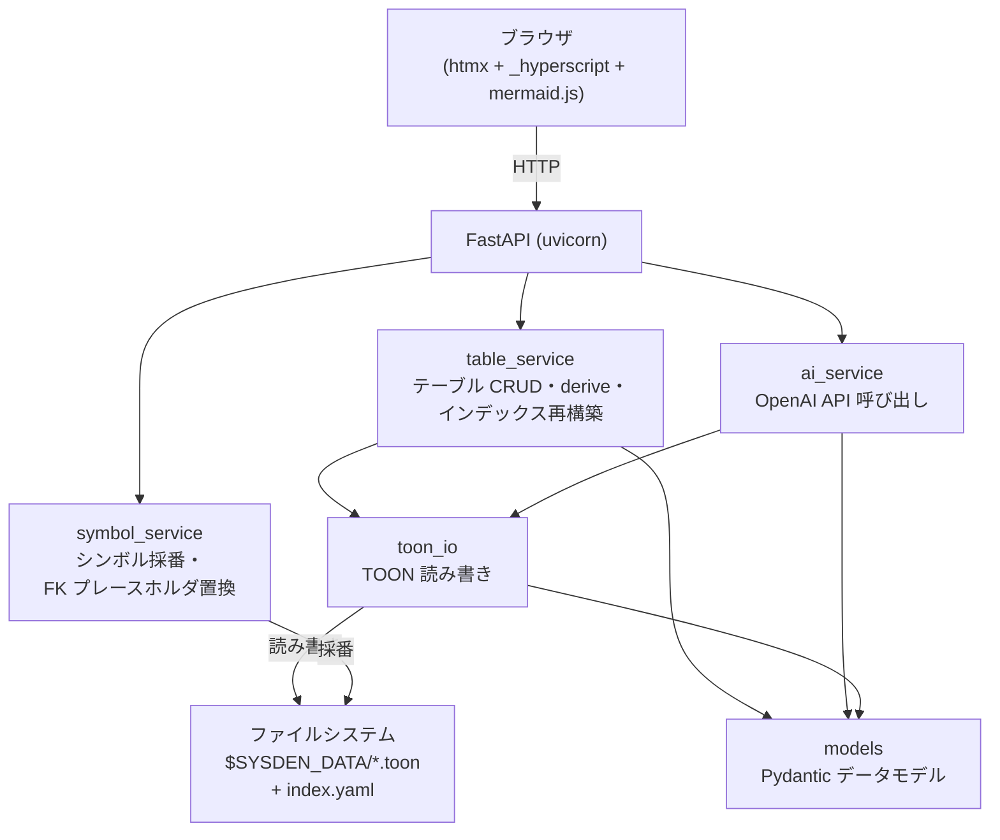

# sysden — テーブル設計 Web アプリ 設計ドキュメント

**日付**: 2026-06-19
**最終更新**: 2026-06-26
**ステータス**: 承認済み

## 概要

- テーブル設計（カラム定義）を TOON ファイルで管理・閲覧する Web アプリ
- **人向けのテキストエディタは提供しない**。設計の作成・更新はブラウザ上の依頼 UI から AI（OpenAI）に依頼して行う
- AI はコア設計（meta + columns）のみを生成し、logical・physical・dao はサーバー側で自動導出する
- ストレージは **ファイルシステム**（TOON ファイル）
- フロントエンドは **htmx + _hyperscript + Jinja2 + mermaid.js + markdown-it-py**

---

## 要件サマリ

| 項目 | 内容 |
|---|---|
| コア体験 | 依頼文を送る → AI が TOON 形式のコア設計を生成・更新 → logical/physical/dao を自動導出 → ブラウザ表示 |
| 永続化 | ファイルシステム。環境変数 `SYSDEN_DATA` で指定したディレクトリ（省略時: `.data`） |
| ファイル形式 | `<SYSDEN_DATA>/<table_name>.toon`（TOON フォーマット）、`<SYSDEN_DATA>/index.toon`（テーブル一覧・ER 図・ルール） |
| シンボル管理 | `<SYSDEN_DATA>/index.yaml` でテーブルシンボルの連番を管理 |
| AI 連携 | FastAPI バックエンドが OpenAI API を呼び出しコア設計を生成 |
| 認証 | `OPENAI_API_KEY` を `.env` から取得 |

---

## TOON フォーマット

<!-- derived-from ./table-design-flow.md#toon-フォーマット -->

[TOON](https://github.com/toon-format/toon) は LLM 向けに提案されているデータフォーマット。AI が生成するコア設計と、サーバーが導出するセクションを格納する。

### テーブル定義（`{name}.toon`）

```
meta:
  symbol: TABLE_0001
  logical_name: ユーザー
  physical_name: users
  description: ユーザー情報を管理する

columns[4]{symbol,logical_name,physical_name,type,nullable,pk,unique,default,fk_target,description}:
  COLUMN_0001,メールアドレス,email,varchar(255),NO,NO,YES,,
  COLUMN_0002,ユーザー名,name,varchar(100),NO,NO,NO,,
  COLUMN_0003,所属部署,department_id,uuid,NO,NO,NO,,TABLE_0002,部署テーブルへの参照
  COLUMN_0004,電話番号,phone,varchar(20),YES,NO,NO,,

logical[4]{カラム名,型,ユニーク,説明}:
  * メールアドレス,文字列(255),○,
  * ユーザー名,文字列(100),,
  ...

physical[7]{column_name,type,nullable,pk,unique,default,description}:
  id,uuid,NO,YES,YES,uuidv7(),サロゲートキー
  email,varchar(255),NO,NO,YES,,
  ...
  created_at,timestamptz,NO,NO,NO,now(),作成日時
  updated_at,timestamptz,NO,NO,NO,now(),更新日時
  disabled_at,timestamptz,YES,NO,NO,NONE,無効化日時

dao[7]{column_name,python_type,required,min,max,max_length,description}:
  id,UUID,YES,,,, サロゲートキー
  email,str,YES,,,,
  ...
```

### インデックス（`index.toon`）

```
meta:
  description: テーブル設計インデックス

rules:
  - 共通ルール 1
  - 共通ルール 2

tables[2]{symbol,name,logical_name,description}:
  TABLE_0001,users,ユーザー,ユーザー情報を管理する
  TABLE_0002,departments,部署,部署情報を管理する

er_diagram:
  erDiagram
    TABLE_0001["ユーザー"]
    TABLE_0002["部署"]
    TABLE_0002 ||--o{ TABLE_0001 : ""
```

---

## アーキテクチャ



- AI 呼び出しは同期実行
- DB・マイグレーション不要
- SSE はインデックス・ER 図の再構築時のスピナー表示に使用

---

## ルート設計

### HTML ルート（`app/routers/html.py`）

| ルート | メソッド | 役割 | 返却 |
|---|---|---|---|
| `/` | GET | テーブル一覧 + ER 図 + ルール表示 | HTML |
| `/tables/{name}` | GET | テーブル詳細ビューア（logical/physical/dao） | HTML |

### API ルート（`app/routers/api.py`）

| ルート | メソッド | 役割 | 返却 |
|---|---|---|---|
| `/api/tables` | POST | 新規テーブル設計を AI に依頼（複数テーブル同時作成可） | HX-Redirect / 303 |
| `/api/tables/{name}` | POST | 既存テーブル設計を AI に更新依頼 | HX-Redirect / 303 |
| `/api/tables/{name}` | DELETE | テーブル設計を削除 | JSON |
| `/api/rebuild-index-tables` | POST | テーブル一覧（index.toon）を再構築 | HTMLResponse(SSE) / 303 |
| `/api/rebuild-er-diagram` | POST | ER 図を再構築 | HTMLResponse(SSE) / 303 |
| `/api/sse/rebuild-index` | GET | インデックス再構築の SSE ストリーム | SSE |
| `/api/sse/rebuild-er` | GET | ER 図再構築の SSE ストリーム | SSE |

---

## 技術スタック

| パッケージ | 用途 |
|---|---|
| fastapi / uvicorn[standard] | Web サーバー |
| pydantic | データモデル（`ToonDocument`, `Column`, `TableMeta` 等） |
| openai | OpenAI API クライアント |
| pyyaml | プロンプト設定・シンボル連番の YAML 読み書き |
| markdown-it-py | Markdown → HTML 変換（テーブル詳細画面） |
| jinja2 | HTML テンプレート |
| python-multipart | フォームデータ受信 |
| python-dotenv | `.env` ファイル読み込み |
| htmx + _hyperscript | 宣言的 DOM 更新・クライアントロジック |
| mermaid.js | ER 図のブラウザ描画 |

**開発ツール**: uv / taskipy / ruff / ty / pytest

---

## テスト方針

- **unit**: `table_service`（derive_logical/physical/dao、CRUD）、`ai_service`（OpenAI モック）、`toon_io`（TOON パース・シリアライズ）、`symbol_service`（シンボル採番）
- **integration**: FastAPI `TestClient` でルート確認
- **e2e**: `SYSDEN_TEST_MODE=1` でスタブ AI を使用したブラウザテスト
- カバレッジ 80% 以上

---

## スコープ外

- RDBMS・マイグレーション
- ユーザー認証
- Docker（シンプルなファイルアプリのため不要）
